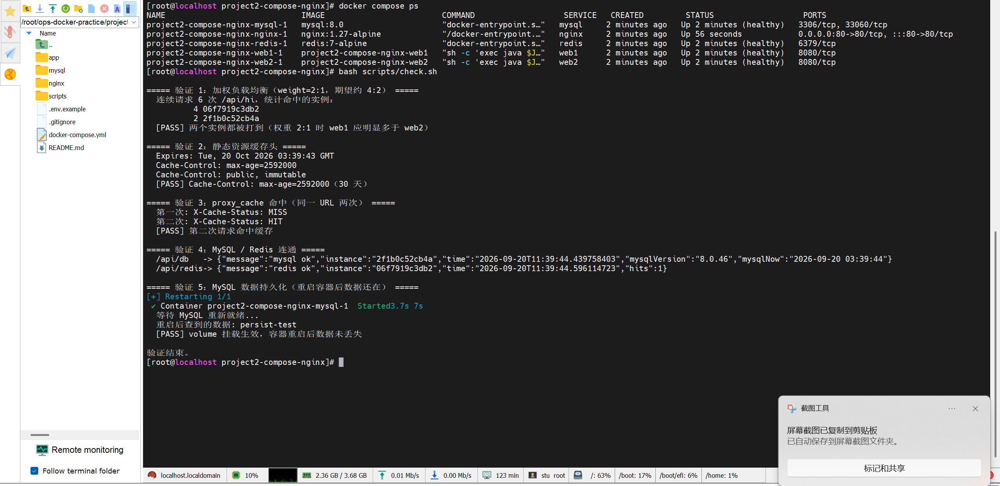

# 项目二：Docker Compose 编排 + Nginx 集群

用 Docker Compose 编排 **Nginx + 双实例 Spring Boot + MySQL + Redis**，验证负载均衡、动静分离、两级缓存与数据持久化。

---

## 1. 这个仓库解决了什么问题

单容器部署没有解决三件事：**启动顺序**、**横向扩展**、**数据存活**。这个项目对着这三点做：

| 要解决的 | 做法 |
|---|---|
| 应用比数据库先起来，连不上库就崩 | `depends_on` + `healthcheck` 的 `condition: service_healthy` |
| 单实例扛不住流量 | Nginx upstream 加权轮询，两个应用实例同时提供服务 |
| 容器删了数据就没了 | MySQL / Redis 数据落在 named volume 上 |
| 重复请求打穿到后端 | Nginx `proxy_cache` + 浏览器 `expires` 两级缓存 |

---

## 2. 架构图

```
                             ┌────────────────────────┐
      客户端  ──── :80 ─────▶ │   Nginx 1.27-alpine    │
                             │  动静分离 / 反代 / 缓存 │
                             └───────────┬────────────┘
                                         │ proxy_pass http://backend
                                         │ upstream weight = 2 : 1
                          ┌──────────────┴──────────────┐
                          │                             │
                   ┌──────▼───────┐             ┌───────▼──────┐
                   │   web1:8080  │             │   web2:8080  │
                   │  Spring Boot │             │  Spring Boot │
                   │  非 root 运行 │             │  非 root 运行 │
                   └──────┬───────┘             └───────┬──────┘
                          │                             │
                          └──────────────┬──────────────┘
                                         │   app_net (bridge)
                          ┌──────────────┴──────────────┐
                          │                             │
                   ┌──────▼───────┐             ┌───────▼──────┐
                   │  MySQL 8.0   │             │  Redis 7     │
                   │ mysql_data 卷 │             │ redis_data 卷 │
                   │  GTID/binlog │             │  AOF 持久化   │
                   └──────────────┘             └──────────────┘
```

**请求路径说明**：静态资源命中后缀规则后由 Nginx 直接返回，不经过后端；`/api/` 开头走反向代理到 `backend` upstream；其中 `/api/cache-time` 单独匹配到一个开了 `proxy_cache` 的 location。

---

## 3. 环境版本

| 组件 | 版本 | 说明 |
|---|---|---|
| OS | Rocky Linux 9 / CentOS Stream 9 | CentOS 7 已于 2024-06 EOL，不建议再用 |
| Docker Engine | 27.x | |
| Docker Compose | v2.x | 注意命令是 `docker compose`（空格），不是 `docker-compose` |
| Nginx | 1.27-alpine | |
| Spring Boot | 3.1.12 | 受本机 Maven 3.6.0 限制选定的版本，见"已知局限" |
| JDK（容器运行） | Eclipse Temurin 17 JRE | |
| JDK（容器构建） | Temurin 17 + Maven 3.9 | 多阶段构建，不进最终镜像 |
| MySQL | 8.0 | |
| Redis | 7-alpine | |

---

## 4. 目录结构

```
project2-compose-nginx/
├── README.md
├── .env.example              # 提交到仓库的变量模板
├── .gitignore
├── docker-compose.yml
├── app/                      # Spring Boot 应用源码（多阶段 Docker 构建的上下文）
│   ├── Dockerfile
│   ├── maven-settings.xml    # 构建阶段把 central 指向阿里云，绕开容器内访问中央仓库失败
│   ├── pom.xml
│   └── src/main/
│       ├── java/com/wf/opsdemo/
│       │   ├── OpsDemoApplication.java
│       │   └── HiController.java
│       └── resources/application.yml
├── nginx/
│   ├── nginx.conf            # 主配置：日志格式带 upstream/cache 字段
│   ├── conf.d/default.conf   # upstream + server + 缓存策略
│   └── html/                 # 静态资源（验证动静分离用）
│       ├── index.html
│       └── static/app.css
├── mysql/
│   └── my.cnf
└── scripts/
    ├── up.sh                 # 一键启动
    └── check.sh              # 一键跑完整验证套件
```

---

## 5. 快速开始

```bash
git clone <你的仓库地址>
cd ops-docker-practice/project2-compose-nginx

cp .env.example .env
vim .env                      # 把三组默认密码全部改掉

./scripts/up.sh               # 校验配置 -> 构建镜像 -> 启动
docker compose ps             # 五个服务 STATUS 都应为 Up (healthy)
```

首次启动要拉取 MySQL / Redis / Nginx 镜像并做 Maven 构建，**大约 5~15 分钟**，取决于网络和是否配了 Docker 镜像加速。

> 国内环境建议先在 `/etc/docker/daemon.json` 里配 registry-mirrors，否则拉镜像会非常慢。

---

## 6. 验证

### 6.0 实测输出

下面两段是在真实环境（CentOS 7 Core + Docker 26.1.4 + Docker Compose v2.27.1，2 核 3.7G）上跑出来的原始输出，**不是预期值，也没有做过任何修饰**。

**① 服务状态**

```text
$ docker compose ps
NAME                             IMAGE                         COMMAND                   SERVICE   CREATED         STATUS                   PORTS
project2-compose-nginx-mysql-1   mysql:8.0                     "docker-entrypoint.s…"   mysql     2 minutes ago   Up 2 minutes (healthy)   3306/tcp, 33060/tcp
project2-compose-nginx-nginx-1   nginx:1.27-alpine             " /docker-entrypoint.…"   nginx     2 minutes ago   Up 56 seconds            0.0.0.0:80->80/tcp, :::80->80/tcp
project2-compose-nginx-redis-1   redis:7-alpine                "docker-entrypoint.s…"   redis     2 minutes ago   Up 2 minutes (healthy)   6379/tcp
project2-compose-nginx-web1-1    project2-compose-nginx-web1   "sh -c 'exec java $J…"   web1      2 minutes ago   Up 2 minutes (healthy)   8080/tcp
project2-compose-nginx-web2-1    project2-compose-nginx-web2   "sh -c 'exec java $J…"   web2      2 minutes ago   Up 2 minutes (healthy)   8080/tcp
```

> `nginx` 只显示 `Up` 而没有 `(healthy)`，是因为它在 compose 里没有定义 `healthcheck`——它是流量入口，没有需要额外探活的下游依赖。其余四个显示 `(healthy)` 即代表健康检查已通过（`web1/web2` 的健康检查打的是 `/actuator/health`，它同时校验 MySQL 与 Redis 连通性）。

**② 一键验证**

```text
$ bash scripts/check.sh
===== 验证 1：加权负载均衡（weight=2:1，期望约 4:2） =====
连续请求 6 次 /api/hi，统计命中的实例：
4 06f7919c3db2
2 2f1b0c52cb4a
[PASS] 两个实例都被打到（权重 2:1 时 web1 应明显多于 web2）

===== 验证 2：静态资源缓存头 =====
Expires: Tue, 20 Oct 2026 03:39:43 GMT
Cache-Control: max-age=2592000
Cache-Control: public, immutable
[PASS] Cache-Control: max-age=2592000（30 天）

===== 验证 3：proxy_cache 命中（同一 URL 两次） =====
第一次: X-Cache-Status: MISS
第二次: X-Cache-Status: HIT
[PASS] 第二次请求命中缓存

===== 验证 4：MySQL / Redis 连通 =====
/api/db   -> {"message":"mysql ok","instance":"2f1b0c52cb4a","time":"2026-09-20T11:39:44.439758403","mysqlVersion":"8.0.46","mysqlNow":"2026-09-20 03:39:44"}
/api/redis-> {"message":"redis ok","instance":"06f7919c3db2","time":"2026-09-20T11:39:44.596114723","hits":1}

===== 验证 5：MySQL 数据持久化（重启容器后数据还在） =====
[+] Restarting 1/1
✔ Container project2-compose-nginx-mysql-1  Started 3.7s 7s
等待 MySQL 重新就绪...
重启后查到的数据: persist-test
[PASS] volume 挂载生效，容器重启后数据未丢失
验证结束。
```

五项全部 PASS。



> 截图为实机终端原始记录：上半部分是 `docker compose ps`（四个服务 healthy，`nginx` 无 healthcheck 故仅显示 `Up`），下半部分是 `bash scripts/check.sh` 的五项验证结果。

下面按项拆开说明，每一条在验证什么、以及等价的手工命令。

### 6.1 加权负载均衡

```bash
for i in $(seq 1 6); do curl -s http://localhost/api/hi; echo; done
```

期望：6 次请求里 **web1 约 4 次、web2 约 2 次**（upstream 里配的 `weight=2` / `weight=1`）。响应体里的 `instance` 字段是容器 hostname。

```
{"message":"hit by 3f2a1b9c4d5e","instance":"3f2a1b9c4d5e","time":"2026-09-20T10:11:22.123"}
```

> ⚠️ 这条**只能**用 `/api/hi` 验证。`/api/cache-time` 开了代理缓存，命中后 Nginx 不再回源，会永远返回同一台实例的结果。

实测命中分布（就是 6.0 里的验证 1 输出）：

```text
4 06f7919c3db2
2 2f1b0c52cb4a
```

正好落在 `weight=2:1` 的期望比例上。

### 6.2 静态资源缓存头

```bash
curl -I http://localhost/static/app.css | grep -iE 'cache-control|expires'
```

期望：

```
Cache-Control: max-age=2592000
Expires: <30 天后的时间>
Cache-Control: public, immutable
```

`expires 30d` 是给**浏览器**的缓存指令，静态资源不会再到 Nginx 请求。

### 6.3 Nginx 代理缓存命中

```bash
curl -sI http://localhost/api/cache-time | grep -i x-cache-status   # MISS
curl -sI http://localhost/api/cache-time | grep -i x-cache-status   # HIT
```

第二次请求期望拿到 `X-Cache-Status: HIT`。响应体里带了时间戳，命中缓存时**时间戳不会变化**，这是最直观的判断方法。

如果一直 MISS，按顺序排查三条：请求是不是 GET；源站响应有没有带 `Set-Cookie` 或 `Cache-Control: no-cache`；`/var/cache/nginx` 是否可写。

### 6.4 数据层连通

```bash
curl -s http://localhost/api/db      # 返回 MySQL 版本与 SELECT NOW()
curl -s http://localhost/api/redis   # 返回 Redis 累加计数，两实例共享同一个值
```

### 6.5 数据持久化

```bash
# 1) 写入一条数据
docker compose exec -T mysql mysql -uroot -p"$MYSQL_ROOT_PASSWORD" -e \
  "CREATE TABLE IF NOT EXISTS appdb.t_demo(id INT PRIMARY KEY, v VARCHAR(20));
   INSERT INTO appdb.t_demo VALUES(1,'persist-test') ON DUPLICATE KEY UPDATE v='persist-test';"

# 2) 重启 MySQL 容器
docker compose restart mysql

# 3) 等约 15 秒后重查
docker compose exec -T mysql mysql -uroot -p"$MYSQL_ROOT_PASSWORD" -N -B -e \
  "SELECT v FROM appdb.t_demo WHERE id=1;"
```

实测输出：

```text
$ docker compose restart mysql
[+] Restarting 1/1
 ✔ Container project2-compose-nginx-mysql-1  Started  3.7s 7s

$ docker compose exec -T mysql mysql -uroot -p"$MYSQL_ROOT_PASSWORD" -N -B -e "SELECT v FROM appdb.t_demo WHERE id=1;"
persist-test
```

这条最能说明"容器无状态、数据有状态"这件事：容器被销毁重建，但 `mysql_data` 命名卷还在，数据就还在。

---

## 7. 踩坑记录

> 这一节是实务部分，按踩坑的先后顺序排列：**7.1~7.4** 是写这套配置时踩到、并且已经在仓库代码里修掉的；**7.5** 是 MySQL 8 绕不开的经典坑；**7.6** 是在 CentOS 7 虚拟机里实际部署时遇到的容器网络问题（这条排查耗时最长）。

### 7.1 JRE 精简镜像里没有 curl，healthcheck 直接卡死整条链路

`Dockerfile` 的 `HEALTHCHECK` 用了 `curl`，而 `eclipse-temurin:17-jre-jammy` 默认不带 `curl`。后果不是"健康检查失败"这么简单——`docker-compose.yml` 里 nginx 依赖 `web1/web2` 的 `condition: service_healthy`，健康状态永远为 `starting` 或 `unhealthy`，**Nginx 永远不会启动**。

表象是"Nginx 起不来"，根因在 web 容器缺一个二进制文件，不看 web 的 healthcheck 日志很难定位。

修法：在 Dockerfile 的运行阶段显式装（`USER app` 之前执行）：

```dockerfile
RUN apt-get update \
 && apt-get install -y --no-install-recommends curl \
 && rm -rf /var/lib/apt/lists/*
```

### 7.2 proxy_cache 会把负载均衡的验证结果"吃掉"

一开始想省事，直接在 `/api/` 这个 location 上开 `proxy_cache`。结果是验证 6.1 时六次请求全是同一台实例——因为第二次开始就命中缓存了，Nginx 直接返回副本，**根本没往后端转发**。

这不是 bug，是代理缓存的正常行为，但它让两个验证项互相排斥。

修法：拆成两个 location。Nginx 的前缀匹配规则是**最长的优先**，所以 `/api/cache-time` 会抢在 `/api/` 前面匹配：

```nginx
location /api/          { proxy_pass http://backend; /* 不缓存，验证负载均衡 */ }
location /api/cache-time { proxy_pass http://backend; proxy_cache app_cache; /* 验证缓存 */ }
```

### 7.3 compose 变量替换发生在宿主机，不在容器里

Redis 的健康检查最初写成这样：

```yaml
test: ["CMD-SHELL", "redis-cli -a \"$REDIS_PASSWORD\" ping | grep -q PONG"]
```

`$REDIS_PASSWORD` 只有单个 `$`，compose 不会替换它，于是原样传给容器里的 shell；而 redis 容器**根本没注入这个环境变量**，取到的是空字符串，认证失败，容器永远 unhealthy。

要点：`${VAR}` 是 compose 在**解析时**从 `.env` 替换成字面量，`$VAR` 是容器**运行时**由 shell 展开，两者作用域完全不同。

### 7.4 depends_on 不写 condition 等于没写

```yaml
depends_on:
  - mysql          # 只保证容器被创建，不保证 mysqld 就绪
```

MySQL 容器进程起来了不等于能接受连接，中间有几十秒初始化。应用先去连就会拿到连接失败。

正确写法（本仓库采用）：

```yaml
depends_on:
  mysql: { condition: service_healthy }
```

### 7.5 MySQL 8 的默认认证插件变了

MySQL 8 默认 `caching_sha2_password`，老驱动或非加密连接下会报
`Authentication requires secure connection`。

这里在启动命令里显式改回：

```yaml
command: --default-authentication-plugin=mysql_native_password
```

> 这个问题在"项目三"（GTID 主从）里会更致命：从库 IO 线程会卡在 `Slave_IO_Running: Connecting`，很容易被误判成网络问题。

### 7.6 容器内 DNS 解析失败，导致 Maven 构建中断

在 CentOS 7 上首次构建时报：

```
Could not transfer artifact org.springframework.boot:spring-boot-starter-parent:pom:3.1.12
from/to central (https://repo.maven.apache.org/maven2):
repo.maven.apache.org: Temporary failure in name resolution
```

**这不是 Maven 配置问题，是容器内 DNS 不工作。**

原因链：CentOS 7 的宿主机 `/etc/resolv.conf` 常常只有 `nameserver 127.0.0.1`（被 NetworkManager 接管）。Docker 生成容器 resolv.conf 时会丢弃 `127.0.0.1`（在容器里它指向容器自己），然后**回退到 `8.8.8.8`** —— 而国内访问不了 Google DNS，于是容器内所有域名解析全部失败。

注意这个坑有很强的迷惑性：`docker pull` 是 **daemon 在宿主机上**发起的，走 registry-mirrors，所以拉镜像一切正常；只有**容器内部**发起的网络请求才会挂。

两层修法（本仓库只负责第二层）：

1. 给 Docker daemon 配国内 DNS —— 编辑 `/etc/docker/daemon.json` 加 `"dns": ["223.5.5.5", "114.114.114.114"]`，然后 `systemctl restart docker`（这一步是宿主机环境配置，不在仓库范围内）
2. 即便 DNS 正常了，容器直连 Maven 中央仓库在国内也慢到不可用 —— 所以在构建阶段用 `app/maven-settings.xml` 把 `central` 镜像到阿里云公共仓库，由 Dockerfile `COPY` 进 `/root/.m2/settings.xml`

`mirrorOf` 特意只写 `central` 而不是 `*`，避免把项目将来可能声明的私有仓库也一起劫持掉。

**第三层，也是最省事的一层：让构建阶段直接用宿主机网络。**

只换 Maven 镜像源是不够的 —— 如果容器 DNS 根本没工作，连 `maven.aliyun.com` 也解析不了，报错依旧是 `Temporary failure in name resolution`。这种情况下与其去改宿主机的 `daemon.json`，不如让构建时不要走容器自己的网络栈，直接在 `docker-compose.yml` 的 `build` 段声明：

```yaml
build:
  context: ./app
  network: host      # 构建阶段复用宿主机网络与 DNS
```

`network: host` 作用于**整个构建过程的所有阶段**，所以运行阶段里那句 `apt-get install curl` 也一并受益。本仓库已采用这个配置，配合 `maven-settings.xml` 形成两层保险：DNS 正常时走阿里云镜像加速，即使不改宿主机 DNS 也能构建成功。

需要区分清楚的是：**运行时**的容器仍然走 bridge 网络，`network: host` 只影响构建。应用运行时只用容器名（`mysql` / `redis`）互联，由 Docker 内置 DNS 负责，不依赖外部 DNS，所以这样配置是安全的。

---

## 8. 已知局限

诚实交代，这几件事本仓库**没有**做：

1. **验证环境与示例环境的差异**。集群已在 CentOS 7 Core + Docker 26.1.4 + Compose v2.27.1 上跑通全部五项验证（见第 6 节实测输出）。选 CentOS 7 是因为手头虚拟机预装的就是它 —— 该系统已于 2024-06 EOL，**新环境建议用 Rocky Linux 9 / AlmaLinux 9**（用法一致，二进制兼容 RHEL）。开发机（Windows）没有 Docker，所以源码构建是另外用本机 JDK 21 + Maven 3.6.0 单独验证过的。
2. **Spring Boot 版本受构建环境限制**。选 3.1.12 而不是更新的 3.3/3.5，是因为开发机 Maven 是 3.6.0（2018 年发布），而 Spring Boot 3.2+ 依赖链里的 maven-compiler-plugin 等要求 Maven ≥ 3.6.3。容器里用的是 Maven 3.9，理论上可以升，那样就失去了本机可复现构建的能力——权衡后保留了能在两种环境都编过的组合。
3. **MySQL 容器时区与应用不一致**。`my.cnf` 里声明了 `default-time-zone = '+08:00'`，但实测 `SELECT NOW()` 返回的仍是 UTC（与应用日志里的 Asia/Shanghai 差 8 小时），说明该配置项没有生效，挂载路径需要进一步确认。**此项待查，不影响功能验证。**
4. **没有 HTTPS**，Nginx 只监听 80 端口，证书配置不在范围内。
5. **没有资源限制**，compose 里没设 `mem_limit` / `cpus`，生产环境必须加。
6. **没有做压测**，权重 2:1 是人为设定的，不代表真实容量评估结论。
7. **MySQL 是单实例**，没有主从。主从 + 哨兵的 HA 部分在「项目三」。
