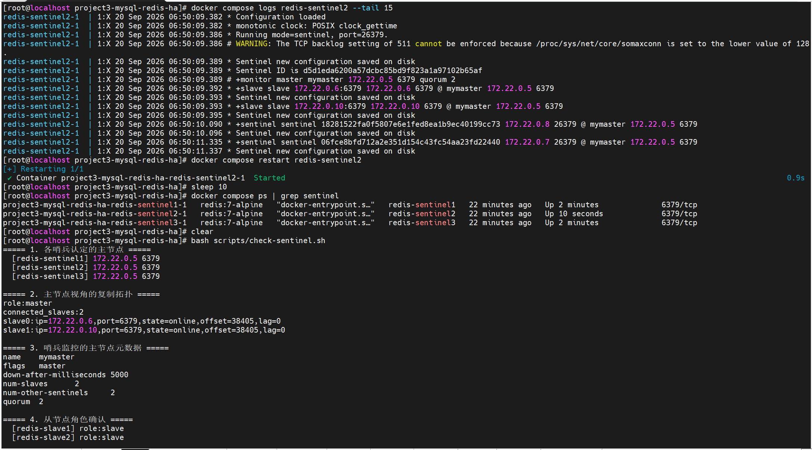
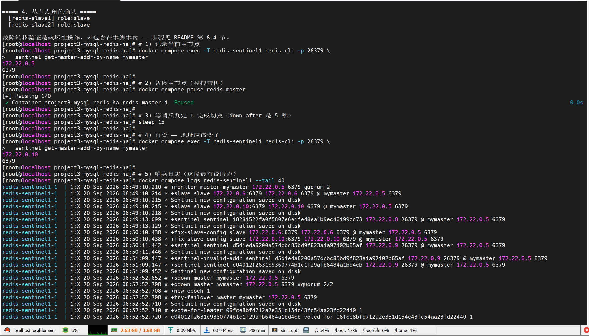
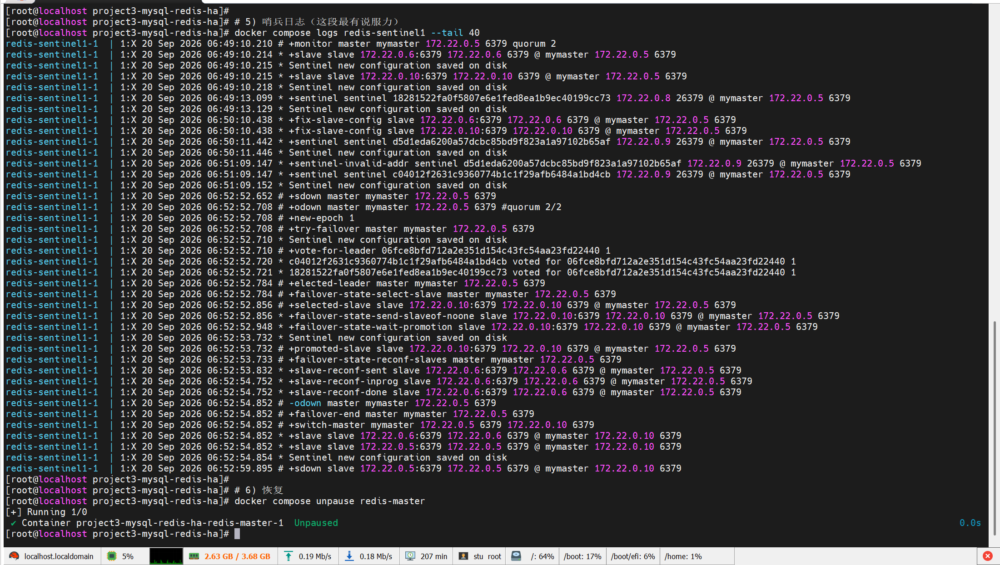

# 项目三：MySQL GTID 一主两从 + Redis 一主两从三哨兵

用 Docker Compose 编排 **MySQL 8 GTID 主从集群**与 **Redis 7 哨兵高可用集群**，并验证数据同步、从库只读、哨兵自动故障转移。

---

## 1. 这个项目解决什么问题

| 要解决的 | 做法 |
|---|---|
| 单库挂了数据就没了 | MySQL 一主两从，binlog + GTID 做异步复制 |
| 复制位点难维护 | 用 GTID：`SOURCE_AUTO_POSITION=1` 让从库自动定位同步点 |
| 缓存层单点 | Redis 一主两从，三个哨兵监控主节点 |
| 主节点宕机要人工介入 | 哨兵自动完成选主与切换（**仅 Redis，MySQL 不支持**） |

---

## 2. 架构图

```
         ┌──────────────────────────────────────────────┐
         │            MySQL 8：GTID 一主两从              │
         └──────────────────────────────────────────────┘

                      ┌───────────────────┐
                      │   mysql-master    │
                      │   server-id = 1   │
                      │   binlog (ROW)    │
                      │   gtid_mode = ON  │
                      └─────────┬─────────┘
                                │ GTID 异步复制
                     ┌──────────┴──────────┐
                     │                     │
            ┌────────▼────────┐   ┌────────▼────────┐
            │  mysql-slave1   │   │  mysql-slave2   │
            │  server-id = 2  │   │  server-id = 3  │
            │  read_only = ON │   │  read_only = ON │
            └─────────────────┘   └─────────────────┘

         ┌──────────────────────────────────────────────┐
         │      Redis 7：一主两从 + 三节点哨兵            │
         └──────────────────────────────────────────────┘

                      ┌───────────────────┐
                      │   redis-master    │◀──── 监控 ────┐
                      │      :6379        │               │
                      └─────────┬─────────┘               │
                                │ 主从复制                 │
                     ┌──────────┴──────────┐              │
                     │                     │              │
            ┌────────▼────────┐   ┌────────▼────────┐     │
            │  redis-slave1   │   │  redis-slave2   │     │
            │ replicaof master│   │ replicaof master│     │
            └─────────────────┘   └─────────────────┘     │
                                                           │
        ┌─────────────────────────────────────────────────┴┐
        │  sentinel1    sentinel2    sentinel3   (:26379)  │
        │  quorum = 2：单个哨兵判定主观下线后，需再获 1 票   │
        │  才判定客观下线并触发故障转移                      │
        └──────────────────────────────────────────────────┘
```

**两套集群的可靠性边界不一样**——MySQL 这套只是"数据有副本"，故障转移要人工；Redis 这套哨兵会自动切主。这点在"已知局限"里展开。

---

## 3. 环境

| 组件 | 版本 |
|---|---|
| OS | CentOS 7 Core（与项目二同一台机器） |
| Docker Engine | 26.1.4 |
| Docker Compose | v2.27.1 |
| MySQL | 8.0 |
| Redis | 7-alpine |

---

## 4. 目录结构

```
project3-mysql-redis-ha/
├── README.md
├── .env.example
├── .gitignore
├── docker-compose.yml
├── mysql/
│   ├── master.cnf          # server-id = 1
│   ├── slave1.cnf          # server-id = 2
│   └── slave2.cnf          # server-id = 3  ← 必须用独立文件，原因见踩坑 7.1
├── redis/
│   ├── redis-master.conf   # 不含密码，密码走启动参数
│   ├── redis-slave.conf    # 同上，多一行 replicaof
│   └── sentinel.conf       # 模板，运行时复制到容器可写层
└── scripts/
    ├── init-replication.sh   # 一键建立 MySQL 主从
    ├── check-replication.sh  # 检查复制状态
    └── check-sentinel.sh     # 检查哨兵与拓扑
```

---

## 5. 快速开始

### ⚠️ 先停掉项目二

本项目要起 **9 个容器**，其中 3 个是 MySQL。你的机器是 3.7G 内存，两套项目同时跑会 OOM。

```bash
cd /root/ops-docker-practice/project2-compose-nginx
docker compose stop
```

（如果还想再省 470MB，可以停掉系统里那个原生安装的 MySQL：`systemctl stop mysqld`。）

### 启动项目三

```bash
cd /root/ops-docker-practice/project3-mysql-redis-ha

cp .env.example .env
cat > .env <<'EOF'
MYSQL_ROOT_PASSWORD=RootPwd2026abc
REPL_PASSWORD=ReplPwd2026abc
REDIS_PASSWORD=RedisPwd2026abc
EOF

docker compose config --quiet && echo "配置 OK"    # 不应有任何 WARN
docker compose up -d
docker compose ps
```

MySQL 首次初始化较慢，等 1~2 分钟再看状态。9 个容器里，6 个定义了健康检查（3 个 MySQL + 1 个 redis-master），哨兵和 Redis 从节点没有配置 healthcheck（它们的可用性由哨兵机制本身保证）。

### 建立 MySQL 主从

**容器起来 ≠ 主从已建立**。复制关系要用脚本显式建立：

```bash
bash scripts/init-replication.sh
```

---

## 6. 验证

### 6.1 MySQL 复制状态

```bash
bash scripts/check-replication.sh
```

实测输出（两个从库结果一致，已省略重复的 mysql 密码警告）：

```text
$ bash scripts/init-replication.sh
==> 1/3 在主库创建复制账号
==> 2/3 配置 mysql-slave1：指向主库，启用 GTID 自动定位
==> 2/3 配置 mysql-slave2：指向主库，启用 GTID 自动定位
==> 3/3 等待复制链路建立

----- mysql-slave1 -----
Replica_IO_Running: Yes
Replica_SQL_Running: Yes
Seconds_Behind_Source: 0
Last_IO_Error:
Last_SQL_Error:
Replica_SQL_Running_State: Replica has read all relay log; waiting for more updates
Last_IO_Error_Timestamp:
Last_SQL_Error_Timestamp:
Retrieved_Gtid_Set: 36a22150-b4ba-11f1-b709-0242ac160002:1-3
Executed_Gtid_Set: 36a22150-b4ba-11f1-b709-0242ac160002:1-3

----- mysql-slave2 -----
Replica_IO_Running: Yes
Replica_SQL_Running: Yes
Seconds_Behind_Source: 0
Last_IO_Error:
Last_SQL_Error:
Retrieved_Gtid_Set: 36a22150-b4ba-11f1-b709-0242ac160002:1-3
Executed_Gtid_Set: 36a22150-b4ba-11f1-b709-0242ac160002:1-3
```

**判断依据**：`Replica_IO_Running` 与 `Replica_SQL_Running` 双 Yes，且 `Retrieved_Gtid_Set` 与 `Executed_Gtid_Set` 完全相同（说明收到的 GTID 已全部执行完，无积压）。两个从库看到的是同一个 UUID（`36a22150-...`），证明它们都从同一个主库复制。

### 6.2 数据同步

```bash
# 主库写入
docker compose exec -T mysql-master mysql -uroot -p"$MYSQL_ROOT_PASSWORD" -e \
  "CREATE DATABASE IF NOT EXISTS ha_demo;
   CREATE TABLE IF NOT EXISTS ha_demo.t(id INT PRIMARY KEY, v VARCHAR(20));
   INSERT INTO ha_demo.t VALUES(1,'hello-gtid') ON DUPLICATE KEY UPDATE v='hello-gtid';"

# 两个从库分别查询
for s in mysql-slave1 mysql-slave2; do
  echo "--- $s ---"
  docker compose exec -T "$s" mysql -uroot -p"$MYSQL_ROOT_PASSWORD" -N -B -e "SELECT * FROM ha_demo.t;"
done
```

两个从库都能查到 `hello-gtid` 即 GTID 复制通了。

实测输出：

```text
# 主库写入（无输出即成功）
$ docker compose exec -T mysql-master mysql -uroot -p"$MYSQL_ROOT_PASSWORD" -e \
  "CREATE DATABASE IF NOT EXISTS ha_demo; ... INSERT INTO ha_demo.t VALUES(1,'hello-gtid') ..."
mysql: [Warning] Using a password on the command line interface can be insecure.

# 两个从库分别查询
--- mysql-slave1 ---
1       hello-gtid
--- mysql-slave2 ---
1       hello-gtid
```

主库写一条，两个从库都同步到了。

### 6.3 从库只读

```bash
docker compose exec -T mysql-slave1 mysql -uroot -p"$MYSQL_ROOT_PASSWORD" -e \
  "SELECT @@read_only, @@super_read_only;"
```

实测输出：

```text
@@read_only     @@super_read_only
1       0
```

`read_only = 1` 生效。注意 **root 有 SUPER 权限，仍然能写**（`super_read_only = 0`）——这是刻意保留的，方便验证；生产环境应再加 `super_read_only = ON`。

### 6.4 Redis 哨兵与故障转移

先看当前状态：

```bash
bash scripts/check-sentinel.sh
```

然后模拟主节点宕机：

```bash
# 1) 记录当前主节点
docker compose exec -T redis-sentinel1 redis-cli -p 26379 \
  sentinel get-master-addr-by-name mymaster
# 期望输出：redis-master  172.x.x.x  6379

# 2) 暂停主节点（比 stop 更接近"进程卡死"的场景）
docker compose pause redis-master

# 3) 等 10 秒让哨兵完成判定与切换
sleep 10

# 4) 再查主节点
docker compose exec -T redis-sentinel1 redis-cli -p 26379 \
  sentinel get-master-addr-by-name mymaster
# 期望：地址变成某个从节点的 IP → 自动故障转移成功

# 5) 看哨兵日志
docker compose logs redis-sentinel1 --tail 40

# 6) 恢复
docker compose unpause redis-master
```

恢复后原来的主节点会以**从节点**身份重新加入，不会抢占主角色。

### 实测输出

> 说明：实测那次 Docker 分配的是 `172.22.0.0/16` 网段。改用固定网段后地址会变成 `172.28.0.x`，流程与结论完全一致。

**切换前** —— 三个哨兵一致认定 `172.22.0.5` 为主节点：

```text
===== 1. 各哨兵认定的主节点 =====
  [redis-sentinel1] 172.22.0.5 6379
  [redis-sentinel2] 172.22.0.5 6379
  [redis-sentinel3] 172.22.0.5 6379

===== 3. 哨兵监控的主节点元数据 =====
name    mymaster
flags   master
down-after-milliseconds 5000
num-slaves      2
num-other-sentinels     2      ← 三个哨兵互相发现
quorum  2
```

**执行 `docker compose pause redis-master` 后**：

```text
$ docker compose exec -T redis-sentinel1 redis-cli -p 26379 sentinel get-master-addr-by-name mymaster
172.22.0.10                    ← 主节点已切换
6379
```

**哨兵日志（核心证据）**：

```text
06:52:52.652 # +sdown master mymaster 172.22.0.5 6379                    ← 主观下线
06:52:52.708 # +odown master mymaster 172.22.0.5 6379 #quorum 2/2         ← 客观下线，2/2 票
06:52:52.708 # +new-epoch 1
06:52:52.710 # +vote-for-leader 06fce8bfd712a2e351d154c43fc54aa23fd22440 1
06:52:52.720 * c04012f2631c9360774b1c1f29afb6484a1bd4cb voted for 06fce8bf... 1
06:52:52.721 * 18281522fa0f5807e6e1fed8ea1b9ec40199cc73 voted for 06fce8bf... 1
06:52:52.784 # +elected-leader master mymaster 172.22.0.5 6379
06:52:52.856 # +selected-slave slave 172.22.0.10:6379                     ← 选出新主
06:52:53.732 # +promoted-slave slave 172.22.0.10:6379                     ← 提升为新主
06:52:54.752 * +slave-reconf-done slave 172.22.0.6:6379                   ← 另一从库改指新主
06:52:54.852 # -odown master mymaster 172.22.0.5 6379
06:52:54.852 # +failover-end master mymaster 172.22.0.5 6379
06:52:54.852 # +switch-master mymaster 172.22.0.5 6379 172.22.0.10 6379   ★ 切换完成
06:52:54.852 * +slave slave 172.22.0.5:6379 @ mymaster 172.22.0.10 6379   ← 原主降为从库
```

**从 `+sdown` 到 `+switch-master` 用时 2.2 秒。** 三个哨兵都参与了投票，quorum 2/2 达成，原主恢复后正确降级为从库、没有抢回主角色。

### 终端截图

三哨兵集群就绪与拓扑（三个哨兵认定的主节点一致，`num-other-sentinels = 2`）：



故障转移前后的主节点地址对比（`172.22.0.5` → `172.22.0.10`）：



哨兵完整故障转移日志（含 `+sdown` / `+odown #quorum 2/2` / `+promoted-slave` / `+switch-master`）：



---

## 7. 踩坑记录

### 7.1 两个从库不能共用一个配置文件（server-id 会重复）

很多教程让从库共用一个 `slave.cnf`，然后注释一句"slave2 改成 3"。但容器挂载是同一份文件，**两个从库会拿到相同的 `server-id`**，复制直接失败：

```
Fatal error: The slave I/O thread stops because master and slave have equal MySQL server ids
```

这个报错指向性很强，但如果你没意识到"两个容器挂的是同一个文件"，就会一直盯着配置内容看，看不出问题。

**本仓库的做法**：拆成 `slave1.cnf`（server-id=2）和 `slave2.cnf`（server-id=3），两个容器各挂各的。

### 7.2 Redis 配置文件里写 `${REDIS_PASSWORD}` 是无效的

Redis **不会展开 shell 或 Docker 的变量**，写进 conf 的 `${REDIS_PASSWORD}` 会被当成**字面量密码**——表现是客户端认证一直失败，而配置文件看起来完全正确。

常见但不完美的解法：用 `envsubst` 在启动时替换。但 `redis:7-alpine` 镜像里**没有 `envsubst`**（它来自 gettext 包），这个方案在 alpine 上直接跑不通。

**本仓库的做法**：conf 文件保持无密钥状态，密码通过 `docker compose` 的 `command` 以启动参数传入：

```yaml
command: >
  sh -c "redis-server /usr/local/etc/redis/redis.conf
         --requirepass ${REDIS_PASSWORD}
         --masterauth ${REDIS_PASSWORD}"
```

`${REDIS_PASSWORD}` 是 **compose 在宿主机解析时**替换的，Redis 拿到的已经是明文参数。配置文件因此可以直接提交到仓库，不泄露任何密钥。

### 7.3 Sentinel 会重写自己的配置文件

Redis Sentinel 启动后会把运行时状态（已知从库列表、纪元、当前主库地址）**回写**到自己的配置文件。这会带来两个问题：

1. 仓库里提交的那份文件会被写脏，下次 `git status` 全是改动；
2. 三个哨兵如果挂载同一个文件，会互相覆盖，状态错乱。

**本仓库的做法**：`sentinel.conf` 只作为**只读模板**挂载，启动时复制到容器可写层再运行：

```yaml
command: >
  sh -c "cp /usr/local/etc/redis/sentinel.conf /tmp/sentinel.conf
         && echo 'sentinel auth-pass mymaster ${REDIS_PASSWORD}' >> /tmp/sentinel.conf
         && redis-sentinel /tmp/sentinel.conf"
```

每个哨兵容器有自己独立的 `/tmp/sentinel.conf`，互不干扰；仓库里的模板永远干净。

> 副作用：容器重建后运行时状态会丢失，哨兵重新发现拓扑。对练习环境无影响。

另外 `sentinel auth-pass` 必须写在 `sentinel monitor` **之后**，所以用 `>>` 追加到文件末尾，顺序正好正确。

### 7.4 MySQL 8 复制账号必须用 mysql_native_password

这是整个项目**最容易卡住**的地方。MySQL 8 默认认证插件改为 `caching_sha2_password`，在非加密连接下做复制会报：

```
Authentication requires secure connection
```

而 `SHOW REPLICA STATUS` 里显示的是 `Replica_IO_Running: Connecting`——**看起来像网络不通**，很容易往防火墙、容器网络方向排查，白费时间。

修法（已在 `init-replication.sh` 中）：

```sql
CREATE USER 'repl'@'%' IDENTIFIED WITH mysql_native_password BY '...';
```

同时 MySQL 容器启动参数也要加 `--default-authentication-plugin=mysql_native_password`。

### 7.5 术语变更：SLAVE → REPLICA

MySQL 8.0.22 起，`SHOW SLAVE STATUS` / `START SLAVE` 改叫 `SHOW REPLICA STATUS` / `START REPLICA`，字段名也从 `Slave_IO_Running` 变成 `Replica_IO_Running`。8.4 起 `SHOW MASTER STATUS` 也改叫 `SHOW BINARY LOG STATUS`。

**用错术语会直接报错**，而网上大量教程用的还是老写法。看文档时务必确认版本。

### 7.6 配置文件权限 777 会被 MySQL 静默忽略

在从 Windows 打包、传到 Linux 解压的场景下会遇到：

```
mysql: [Warning] World-writable config file '/etc/mysql/conf.d/master.cnf' is ignored.
```

Windows 的 `tar` 不保存 Unix 权限位，解压出来的文件是 `777`。**MySQL 出于安全考虑会拒绝加载"全局可写"的配置文件**——注意它只是打一行 Warning，然后继续正常启动。

后果是配置文件里**所有内容都不生效**（不只是报错的那一项）。本项目里表现为：

```
ERROR 1777 (HY000): CHANGE REPLICATION SOURCE TO SOURCE_AUTO_POSITION = 1
cannot be executed because @@GLOBAL.GTID_MODE = OFF
```

因为 `gtid_mode=ON` 没被加载，而 `server_id`、`read_only` 其实也全都没生效——三个实例 server-id 都是默认的 1。排查时很容易盯着 GTID 配置看，意识不到是**整个文件被忽略**了。

修法：

```bash
chmod 644 mysql/*.cnf
docker compose restart mysql-master mysql-slave1 mysql-slave2
```

打包侧的根治办法是显式指定权限（`tar --mode`，或用 Python `tarfile` 逐个设 `ti.mode`），本仓库的分发包已按"目录 755 / `.sh` 755 / 其余 644"规范化。

> 顺带一提：**Nginx、Redis 都不做这项检查**，所以这个坑只会在 MySQL 上暴露出来。

### 7.7 compose 的 command 用字符串形式会被二次分词

哨兵最初写成：

```yaml
command: >
  sh -c "cp /usr/local/etc/redis/sentinel.conf /tmp/sentinel.conf
         && echo '...' >> /tmp/sentinel.conf
         && redis-sentinel /tmp/sentinel.conf"
```

容器日志直接刷屏：

```
sh: syntax error: unexpected "&&"
```

YAML 的 `>` 本身会把三行折成单行，这一步是对的；但 compose 对**字符串形式**的 `command` 还会再按 shell 规则做一次分词，`&&` 和嵌套引号就在这一步被拆散了。

有意思的是，同一份文件里 `redis-server` 那条 command 用的是同样写法却**能正常工作**——因为它那行只有空格分隔的参数，没有 `&&` 和引号嵌套。**同一个写法、有的能跑有的不能跑**，正是这类问题难查的原因。

改用数组形式，让 `sh -c` 收到完整脚本，不做二次解析：

```yaml
command:
  - sh
  - -c
  - |
    cp /usr/local/etc/redis/sentinel.conf /tmp/sentinel.conf
    echo "sentinel auth-pass mymaster ${REDIS_PASSWORD}" >> /tmp/sentinel.conf
    exec redis-sentinel /tmp/sentinel.conf
```

多行脚本用 `|` 块保留换行，三行各自独立，连 `&&` 都不需要。

### 7.8 Redis 7.4 + alpine 下哨兵解析 master 主机名失败

哨兵容器一直 `Restarting`，日志是：

```
>>> 'sentinel monitor mymaster redis-master 6379 2'
Can't resolve instance hostname.
1:X # Failed to resolve hostname 'redis-master'
*** FATAL CONFIG FILE ERROR (Redis 7.4.11) ***
```

**这个坑难在证据会误导你**：同一个网络里，`redis-slave1/2` 用 `replicaof redis-master 6379` **是能正常连上主库的**（`connected_slaves:2`）。也就是说容器名的 DNS 解析本身没问题，于是会本能地排除 DNS 方向，转去查权限、查配置内容——全是错的。

根因是：**Redis 7.4 的 Sentinel 在加载配置文件阶段就解析 master 主机名**，而 `redis:7-alpine` 用的是 musl libc，它的 `getaddrinfo` 行为与 glibc 有差异，在这个场景下解析失败就直接 FATAL 退出（7.2 及更早版本不做这项检查）。

两种解法：

1. **固定 IP（本仓库采用）** —— compose 用 `ipam` 给 redis-master 分配静态地址，`sentinel.conf` 里写这个 IP：

   ```yaml
   networks:
     ha_net:
       driver: bridge
       ipam:
         config:
           - subnet: 172.28.0.0/16
   # redis-master:
   #   networks: { ha_net: { ipv4_address: 172.28.0.10 } }
   ```

2. **降级镜像** —— 换成 `redis:7.2-alpine`，可以继续用容器名。代价是版本不是最新。

**排查时顺带排除掉的两个方向**（避免重复劳动）：

- 不是文件写权限问题：容器实际以 `uid=0(root)` 运行，`/data`、`/tmp` 都可写
- 不是认证问题：`auth-pass` 未生效会让哨兵认为主节点不可达，但不会导致进程退出

---

## 8. 已知局限

如实交代，这几件事本仓库**没有**做：

1. **MySQL 这套没有自动故障转移。** 哨兵只管 Redis。

   主库宕机后，要人工挑一个从库、执行 `STOP REPLICA` + `RESET REPLICA ALL`、把它提升为主库、再改写其余从库的指向。自动切换需要引入 **Orchestrator** 或 **MHA**，它们负责探活、选主、改写复制指向、处理脑裂——比这套练习项目复杂一个量级。

   面试被问"MySQL 主库挂了怎么办"，正确的说法是：

   > 这套做到的是**数据不丢、故障可查、可人工切换**；自动故障转移要引入 Orchestrator / MHA，我了解它的选主逻辑，但没有在生产环境跑过。

   **这句话照实说，可信度远高于吹牛。**

2. **异步复制，存在数据丢失窗口。** 主库提交后不等从库确认就返回，主库宕机时未同步的 binlog 会丢。要强一致需要半同步复制（`rpl_semi_sync`）或 MySQL Group Replication。

3. **所有容器在同一台机器。** 这是单机模拟，机器挂了整个集群都没了，不具备真正的机房级高可用。

4. **哨兵数量为 3、quorum 为 2** 是最小可用配置。生产环境哨兵应该跨机器部署，否则机器宕机时哨兵也一起没了。

5. **`read_only` 对 SUPER 权限账号无效**（root 仍能写从库），生产环境需要 `super_read_only = ON`。

6. **没有资源限制**，compose 里没设 `mem_limit`。3 个 MySQL 实例已把 `innodb_buffer_pool_size` 压到 64M 以适应 3.7G 内存的机器。

7. **哨兵配置里写的是固定 IP，不是容器名**。这是为了绕开 Redis 7.4 + alpine 的主机名解析问题（踩坑 7.8），属于兼容性妥协而非最佳实践——哨兵感知 master 的理想方式应该是容器名或 DNS 名称。换用 `redis:7.2-alpine`、或改用 glibc 基础镜像，就可以恢复用容器名。

8. **项目三的截图尚未补进仓库**。`docs/images/` 里目前只有项目二的截图；项目三的四项验证输出已完整记录在本 README 第 6 节，全部是实机运行的原始输出，但没有配套的终端截图。
